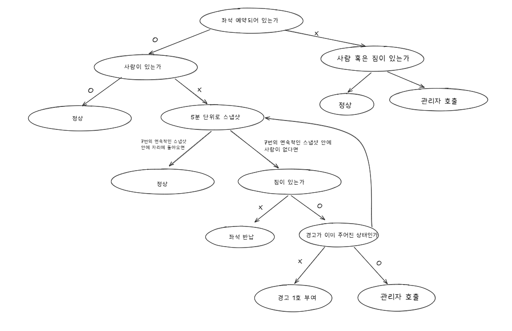

# 📚 도서관 유령 좌석 감지 시스템 v2

AI 기반 실시간 도서관 좌석 관리 시스템. 카메라로 좌석을 촬영하고 Amazon Bedrock Claude가 사람/짐 유무를 판단하여 유령 예약을 자동으로 감지·경고·반납 처리합니다.

## 프로젝트 개요

대학 도서관에서 예약만 하고 실제로 사용하지 않거나, 짐만 놓고 장시간 자리를 비우는 "유령 예약" 문제를 해결합니다.

### 주요 기능

- **AI 좌석 감지**: 카메라 스냅샷을 Bedrock Claude에 보내 좌석별 사람/짐 유무를 자동 판단
- **자동 상태 관리**: 연속 부재 감지 → 경고 → 자동 반납까지 상태 머신 기반 자동 처리
- **학생 웹앱**: 좌석 예약/취소, 실시간 알림 수신
- **관리자 대시보드**: 전체 좌석 현황, 카메라 모니터링, 이벤트 로그

## 시스템 아키텍처

```
[React 웹앱 (Amplify)]
        ↕
[API Gateway (REST)]
        ↕
[Lambda 함수 4개]
   ↕         ↕
[DynamoDB]  [Bedrock Claude]
```

## 기술 스택

| 구분 | 기술 |
|------|------|
| 프론트엔드 | React (Vite) |
| 호스팅 | AWS Amplify |
| 백엔드 | AWS Lambda (Python 3.12) × 4개 |
| API | AWS API Gateway (REST) |
| 데이터베이스 | Amazon DynamoDB × 2개 테이블 |
| AI 분석 | Amazon Bedrock (Claude Haiku) |
| 리전 | us-east-1 (버지니아 북부) |

## 백엔드 동작 흐름

### 1. 좌석 조회 (getSeats)

프론트엔드가 10초마다 좌석 정보를 요청하면, DynamoDB에서 좌석 3개(A1, A2, A3)의 현재 상태를 읽어서 돌려줍니다. 읽기 전용이라 데이터를 수정하지 않습니다.

### 2. 예약/취소 (manageReservation)

학생이 예약을 요청하면 해당 좌석이 AVAILABLE인지 확인하고, 맞으면 상태를 RESERVED로 변경하고 학생 정보를 저장합니다. 취소 시에는 본인 예약인지 확인 후 모든 값(상태, 학생 정보, 카운터)을 초기화합니다.

### 3. 스냅샷 분석 (analyzeSnapshot)

동작 순서:

1. **이미지 수신**: 관리자 페이지에서 10초마다 전송되는 카메라 스냅샷(base64)을 받습니다.
2. **AI 분석**: Bedrock Claude Haiku에 이미지를 보내면서 "왼쪽부터 좌석 1, 2, 3으로 번호를 매기고, 각 좌석에 앉아있는 사람과 짐이 있는지 JSON으로 판단해달라"고 요청합니다.
3. **좌석 매핑**: AI 응답의 좌석 1→A1, 2→A2, 3→A3으로 매핑합니다. 좌석 구분 기준은 의자 위치(왼쪽→오른쪽 순서)입니다.
4. **상태 전이**: 각 좌석에 대해 현재 상태와 AI 판단 결과를 비교하여 상태를 변경합니다.
5. **알림 생성**: 경고나 자동 반납이 발생하면 해당 학생 또는 관리자에게 알림을 notifications 테이블에 저장합니다.

### 4. 알림 조회 (getNotifications)

학생 페이지가 10초마다 해당 학생의 알림을 요청하면, notifications 테이블에서 최신 20개를 시간순(최신 먼저)으로 돌려줍니다.

### 로직


## 좌석 상태 머신

```
AVAILABLE → (예약) → RESERVED → (사람 감지) → OCCUPIED
                                                  ↓ (사람 미감지)
                              ABSENT_WITH_STUFF ← (짐 있음)
                              ABSENT_EMPTY ← (짐 없음)
                                    ↓ (임계값 도달)
                              WARNING_SENT → (재도달) → AUTO_RETURNED → AVAILABLE
```

### 상태 전이 규칙

| 현재 상태 | 조건 | 다음 상태 | 액션 |
|-----------|------|-----------|------|
| AVAILABLE | 사람/짐 감지 | AVAILABLE | 무단 점유 알림 (관리자) |
| RESERVED/OCCUPIED | 사람 감지 | OCCUPIED | 부재 카운터 리셋 |
| RESERVED/OCCUPIED | 사람 미감지 | ABSENT_* | 부재 카운터 +1 |
| ABSENT_* | 임계값 도달 + 짐 없음 | AVAILABLE | 자동 반납 (학생 알림) |
| ABSENT_* | 임계값 도달 + 짐 있음 + 경고 0회 | WARNING_SENT | 경고 발송 (학생 알림), 카운터 리셋 후 재모니터링 |
| WARNING_SENT | 임계값 재도달 + 짐 있음 | AVAILABLE | 관리자 알림 + 자동 반납 |

### 부재 감지 흐름 예시

1. 학생이 좌석 A1을 예약하고 앉음 → **OCCUPIED**
2. 학생이 자리를 비움 (짐은 남겨둠) → 부재 카운트 1, 2, 3, 4... → **ABSENT_WITH_STUFF**
3. 카운트가 임계값(5)에 도달 → 학생에게 경고 알림 전송 → **WARNING_SENT**, 카운트 리셋
4. 학생이 여전히 안 돌아옴 → 다시 부재 카운트 1, 2, 3, 4, 5 → 임계값 재도달
5. 관리자에게 알림 + 좌석 자동 반납 → **AVAILABLE**
6. 도중에 학생이 돌아와서 앉으면 → 즉시 **OCCUPIED**, 모든 카운터 리셋

## 데이터베이스 설계

### library-seats-v2 (좌석 정보)

| 속성 | 타입 | 설명 |
|------|------|------|
| seat_id (PK) | String | 좌석 고유 번호 (A1, A2, A3) |
| status | String | 현재 상태 |
| student_id | String | 예약 학생 학번 |
| student_name | String | 예약 학생 이름 |
| absence_count | Number | 연속 부재 횟수 |
| warning_count | Number | 경고 누적 횟수 |
| has_stuff | Boolean | 짐 유무 |
| updated_at | String | 마지막 업데이트 시간 |

### library-notifications-v2 (알림)

| 속성 | 타입 | 설명 |
|------|------|------|
| student_id (PK) | String | 알림 대상 (학번 또는 ADMIN) |
| created_at (SK) | String | 알림 생성 시간 |
| type | String | 알림 종류 (SEND_WARNING, AUTO_RETURNED 등) |
| message | String | 알림 내용 |
| seat_id | String | 관련 좌석 |

## 프론트엔드 구조

```
frontend/src/
├── App.jsx                    # 라우팅 (/, /admin)
├── api.js                     # API 호출 모듈
├── pages/
│   ├── StudentPage.jsx        # 학생 페이지 (로그인, 예약, 알림)
│   └── AdminPage.jsx          # 관리자 페이지 (대시보드, 카메라, 로그)
└── components/
    ├── SeatCard.jsx           # 좌석 카드 컴포넌트
    └── NotificationBox.jsx    # 알림함 컴포넌트
```

### 페이지 구성

- **`/`** — 학생 페이지: 학번/이름 로그인 → 좌석 예약/취소, 알림 확인 (10초 폴링)
- **`/admin`** — 관리자 페이지: 좌석 대시보드, 카메라 모니터링 (10초 간격 자동 촬영), 이벤트 로그

## API 엔드포인트

| 경로 | 메서드 | Lambda | 설명 |
|------|--------|--------|------|
| `/seats` | GET | getSeats | 전체 좌석 조회 |
| `/reserve` | POST | manageReservation | 예약 (action: reserve) / 취소 (action: cancel) |
| `/snapshot` | POST | analyzeSnapshot | 스냅샷 분석 |
| `/notifications` | GET | getNotifications | 알림 조회 (?student_id=xxx) |

## 환경 변수

### Lambda

| 키 | 설명 |
|----|------|
| `SEATS_TABLE` | 좌석 테이블명 |
| `NOTIFICATIONS_TABLE` | 알림 테이블명 |
| `ABSENCE_THRESHOLD` | 부재 임계값 (기본 5, 데모 시 3) |
| `BEDROCK_MODEL_ID` | Bedrock 모델 ID |

### Amplify

| 키 | 설명 |
|----|------|
| `VITE_API_URL` | API Gateway 호출 URL |


## v1 (해커톤) → v2 변경사항

| 항목 | v1 (해커톤) | v2 (현재) |
|------|-------------|-----------|
| Lambda | 1개 (통합) | 4개 (기능별 분리) |
| 알림 | Slack Webhook | 웹 내 알림함 (DynamoDB) |
| 좌석 인식 | 번호표 기반 | 의자 위치 기반 (왼쪽→오른쪽) |
| 프론트엔드 | 학생+관리자 혼합 | 권한 분리 (/, /admin) |
| 배포 | 실패 | Amplify 자동 배포 |
| DB 설계 | Single Table | 테이블 2개 분리 |